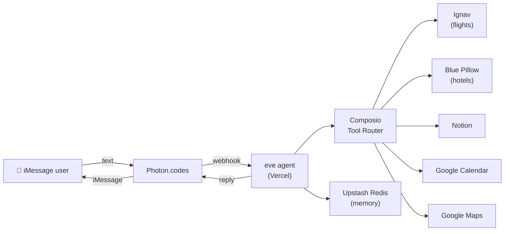

# TripPilot ✈️

**A travel-planning agent that lives in iMessage.**

Text TripPilot like a friend — it searches real flights and hotels, saves your itinerary to Notion, blocks your calendar, and sends Google Maps links. No app to download. No web UI. Just Messages.

Built with [eve](https://eve.dev), deployed on [Vercel](https://vercel.com), delivered over [Photon](https://photon.codes) iMessage, and powered by [Composio](https://composio.dev) for multi-app orchestration.

---

## What it does

1. **Gather trip details** — destination, dates, budget, preferences
2. **Search flights** — via Ignav (Composio)
3. **Find hotels** — via Blue Pillow (Composio)
4. **Save itinerary** — structured page in the user's Notion workspace
5. **Add calendar events** — flights, check-in, check-out, and walkable day-plan stops
6. **Share map links** — tappable Google Maps URLs on the trip brief
7. **Trip brief** — remaining budget, weather, real day stops, Maps links, packing, and Connect Links when apps are not connected

Each iMessage user connects their own Notion and Google Calendar accounts. TripPilot never mixes data between users.

Trip facts live in a typed session dossier (`update_trip` / `get_trip`). Spend vs budget is computed in code. Notion and Calendar writes go through approval-gated tools — the run parks until the user confirms.

---

## Architecture



**Webhook route:** `POST /eve/v1/photon`

---

## Tech stack

| Layer | Technology |
|-------|------------|
| Agent framework | [eve](https://eve.dev) v0.53 |
| Messaging | [Photon](https://photon.codes) iMessage channel |
| Deploy | Vercel + AI Gateway |
| Integrations | Composio (Ignav, Blue Pillow, Notion, Google Calendar, Google Maps) |
| Memory | Upstash Redis documents via `@upstash/agentkit-eve` |
| Model | `google/gemini-2.5-flash` (Vercel AI Gateway) |

---

## Project structure

```
agent/
  instructions.md      # TripPilot identity and travel workflow
  agent.ts             # Model config
  lib/
    trip.ts            # Durable typed trip dossier (defineState)
    destinations.ts    # Code-backed day-plan playbooks
    maps.ts / calendar.ts
    composio.ts        # Per-user session factory + write execute
  channels/
    photon.ts          # iMessage inbound/outbound + per-user auth
    eve.ts             # HTTP session API (OIDC + localDev)
  tools/
    composio.ts        # Search/connect tools, no process-wide cache
    update_trip.ts / get_trip.ts
    trip_brief.ts       # Code-backed days, packing, next actions
    save_itinerary.ts  # Notion write, approval: always()
    add_calendar_events.ts
    google_maps_link.ts
  memory/
    upstash-agentkit.ts  # Durable per-user memory
```

---

## Demo script

Try this in iMessage after setup:

```
Plan a 3-day trip to Tokyo in April, budget $2000.
Find flights from Kuala Lumpur and a hotel near Shibuya.
Send me the trip brief with packing and the day plan.
```

Then:

```
Connect my Notion account
```

After OAuth:

```
Save the itinerary to Notion and add everything to my calendar.
```

---

## Local development

**Prerequisites:** Node.js 24.x, npm

```bash
npm install
# create .env — see Environment variables below
npm run dev            # opens eve TUI at localhost
```

Other commands:

```bash
npm run build
npm run deploy       # deploy to Vercel (loads .env automatically)
npm run typecheck
npm run eval:smoke   # run smoke evals (loads .env automatically)
npx eve channels list   # → eve, photon
```

---

## Reliability & evaluation

Evals run against a local dev server via the same HTTP surface as production. Smoke covers boot + maps. Reliability covers the trip dossier and approval-gated writes. Usefulness covers the code-backed trip brief.

| Eval | Checks |
|------|--------|
| `smoke/greeting` | Agent responds to a hello without crashing |
| `smoke/trip-intake` | Trip prompt calls `update_trip` with Tokyo |
| `smoke/maps-link` | Location request returns a Google Maps URL |
| `reliability/budget-over` | $400 budget + $1800 flight → dossier + over-budget warning |
| `reliability/save-approval` | `save_itinerary` parks on HITL approval (`pending`) |
| `reliability/save-deny` | Deny the parked save → tool `rejected`, never `completed` |
| `reliability/save-approve` | Approve the parked save → tool leaves `pending` and executes |
| `reliability/calendar-approval` | `add_calendar_events` parks on HITL approval (`pending`) |
| `usefulness/trip-brief` | Tokyo + $800/$600 picks → brief with $600 left, stops, Maps, weather, flight time |

```bash
npm run eval:smoke
npm run eval:reliability
npm run eval:usefulness
# or all evals:
npm run eval
```

Runs use `maxConcurrency: 1` to stay under AI Gateway free-tier rate limits.

**Latest smoke run:** 3/3 passed · 6/6 gates

```
✓ smoke/greeting     2/2  (hello without crash)
✓ smoke/trip-intake  2/2  (Tokyo trip reply)
✓ smoke/maps-link    2/2  (Google Maps URL)
```

**Latest reliability run:** 4 passing evals · 19 gates · `google/gemini-2.5-flash`

```
✓ reliability/budget-over        5/5  (dossier + over-budget warning)
✓ reliability/save-approval      3/3  (save_itinerary parked pending)
✓ reliability/calendar-approval  3/3  (add_calendar_events parked pending)
✓ reliability/save-deny          8/8  (deny → rejected, never completed)
```

`reliability/save-approve` is authored (approve → `action.result`, not user-rejected). Last runs hit AI Gateway free-tier 429s on the follow-up model call after the tool executed.

**Latest usefulness run:** 1/1 passed · 9/9 gates · `google/gemini-2.5-flash`

```
✓ usefulness/trip-brief  9/9  ($600 left, Tokyo stops, Maps, 22:15, weather/umbrella)
```

Committed proof for judges:

- [`evals/results/smoke-summary.json`](evals/results/smoke-summary.json)
- [`evals/results/reliability-summary.json`](evals/results/reliability-summary.json)
- [`evals/results/usefulness-summary.json`](evals/results/usefulness-summary.json)

Full local artifacts live under `.eve/evals/` (gitignored as build output).

**Judges can verify by either:**

1. Reading the committed summaries in `evals/results/`
2. Cloning and running `npm run eval:smoke` / `npm run eval:reliability` / `npm run eval:usefulness` (requires `.env`)
3. Inspecting `evals/smoke/*.eval.ts` and `evals/reliability/*.eval.ts`

Memory uses Upstash Redis document storage (`fileMemory` + `redisDocuments`) — durable per-user notes without RediSearch, compatible with Upstash free tier.

Writes to Notion and Google Calendar are **approval-gated** (`save_itinerary`, `add_calendar_events`). The same slugs are blocked on raw Composio tools via `requireApprovalForTools`, so the model cannot skip the human pause.

---

## Environment variables

Create a `.env` file in the project root:

```bash
# Photon iMessage
IMESSAGE_PROJECT_ID=
IMESSAGE_PROJECT_SECRET=
IMESSAGE_WEBHOOK_SECRET=
IMESSAGE_ENDPOINT=https://<your-vercel-app>.vercel.app/eve/v1/photon

# Vercel AI Gateway
AI_GATEWAY_API_KEY=

# Composio Platform
COMPOSIO_API_KEY=

# Upstash Redis (memory)
UPSTASH_REDIS_REST_URL=
UPSTASH_REDIS_REST_TOKEN=
```

Set the same variables in **Vercel → Project → Environment Variables** (Production) before deploying.

### Photon setup

1. Create a project at [app.photon.codes](https://app.photon.codes/)
2. Register your phone as a Spectrum user:
   ```bash
   npx @photon-ai/cli login
   export PHOTON_PROJECT_ID=<your-project-id>
   npx @photon-ai/cli spectrum users add --phone +<E.164> --first-name You --invite
   ```
3. Set the webhook URL to `https://<your-app>.vercel.app/eve/v1/photon`
4. Copy the webhook signing secret into `IMESSAGE_WEBHOOK_SECRET`

### Composio setup

1. Get a Platform API key from [dashboard.composio.dev](https://dashboard.composio.dev/)
2. Users connect Notion and Google Calendar in-chat via OAuth Connect Links (sent automatically when needed)

---

## Deploy

`npm run deploy` loads `.env` locally so the build can resolve Composio, Upstash, and AI Gateway credentials. Git-connected Vercel builds skip a missing `.env` and use **Vercel → Environment Variables** instead.

```bash
npm run deploy
```

Production URL: `https://trippilot-dzulhelmy.vercel.app`

---

## Learn more

- [eve documentation](https://eve.dev/docs)
- [Photon iMessage channel](https://eve.dev/docs/channels/photon)
- [Composio + eve provider](https://docs.composio.dev/docs/providers/eve)
- [Build an Agent tutorial](https://eve.dev/docs/tutorial/first-agent)
