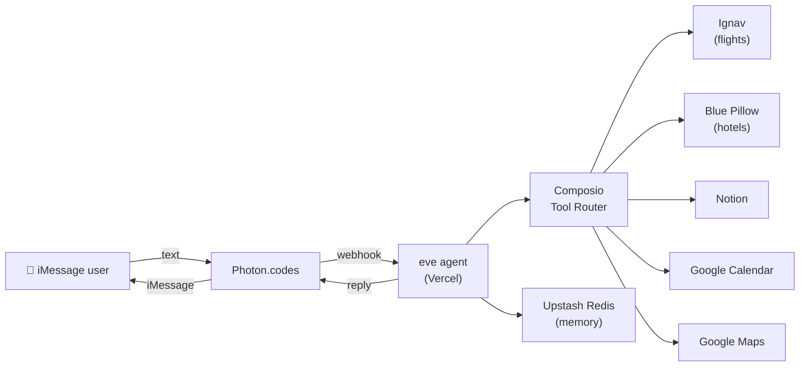

# TripPilot ✈️

**A travel-planning agent that lives in iMessage.**

Text TripPilot like a friend — it searches real flights and hotels, saves your itinerary to Notion, blocks your calendar, and sends Google Maps links. No app to download. No web UI. Just Messages.

Built with [eve](https://eve.dev), deployed on [Vercel](https://vercel.com), delivered over [Photon](https://photon.codes) iMessage, and powered by [Composio](https://composio.dev) for multi-app orchestration.

---

## What it does

1. **Gather trip details** — destination, dates, budget, preferences
2. **Search flights** — via Ignav (Composio)
3. **Find hotels** — via Blue Pillow (Composio)
4. **Save itinerary** — structured page in the user's Notion workspace
5. **Add calendar events** — flights, check-in, check-out, activities
6. **Share map links** — tappable Google Maps URLs for every location

Each iMessage user connects their own Notion and Google Calendar accounts. TripPilot never mixes data between users.

---

## Architecture



**Webhook route:** `POST /eve/v1/photon`

---

## Tech stack

| Layer | Technology |
|-------|------------|
| Agent framework | [eve](https://eve.dev) v0.53 |
| Messaging | [Photon](https://photon.codes) iMessage channel |
| Deploy | Vercel + AI Gateway |
| Integrations | Composio (Ignav, Blue Pillow, Notion, Google Calendar, Google Maps) |
| Memory | Upstash Redis via `@upstash/agentkit-eve` |
| Model | `alibaba/qwen3.7-flash` (Vercel AI Gateway) |

---

## Project structure

```
agent/
  instructions.md      # TripPilot identity and travel workflow
  agent.ts             # Model config
  channels/
    photon.ts          # iMessage inbound/outbound + per-user auth
    eve.ts             # HTTP session API
  tools/
    composio.ts        # Per-user Composio sessions (flights, hotels, etc.)
    google_maps_link.ts
  memory/
    upstash-agentkit.ts  # Durable per-user memory
```

---

## Demo script

Try this in iMessage after setup:

```
Plan a 3-day trip to Tokyo in April, budget $2000.
Find flights from Kuala Lumpur and a hotel near Shibuya.
```

Then:

```
Connect my Notion account
```

After OAuth:

```
Save the itinerary to Notion and add everything to my calendar.
```

---

## Local development

**Prerequisites:** Node.js 24.x, npm

```bash
npm install
# create .env — see Environment variables below
npm run dev            # opens eve TUI at localhost
```

Other commands:

```bash
npm run build
npm run deploy   # deploy to Vercel production
npm run typecheck
```

List channels:

```bash
npx eve channels list   # → eve, photon
```

---

## Environment variables

Create a `.env` file in the project root:

```bash
# Photon iMessage
IMESSAGE_PROJECT_ID=
IMESSAGE_PROJECT_SECRET=
IMESSAGE_WEBHOOK_SECRET=
IMESSAGE_ENDPOINT=https://<your-vercel-app>.vercel.app/eve/v1/photon

# Vercel AI Gateway
AI_GATEWAY_API_KEY=

# Composio Platform
COMPOSIO_API_KEY=

# Upstash Redis (memory)
UPSTASH_REDIS_REST_URL=
UPSTASH_REDIS_REST_TOKEN=
```

Set the same variables in **Vercel → Project → Environment Variables** (Production) before deploying.

### Photon setup

1. Create a project at [app.photon.codes](https://app.photon.codes/)
2. Register your phone as a Spectrum user:
   ```bash
   npx @photon-ai/cli login
   export PHOTON_PROJECT_ID=<your-project-id>
   npx @photon-ai/cli spectrum users add --phone +<E.164> --first-name You --invite
   ```
3. Set the webhook URL to `https://<your-app>.vercel.app/eve/v1/photon`
4. Copy the webhook signing secret into `IMESSAGE_WEBHOOK_SECRET`

### Composio setup

1. Get a Platform API key from [dashboard.composio.dev](https://dashboard.composio.dev/)
2. Users connect Notion and Google Calendar in-chat via OAuth Connect Links (sent automatically when needed)

---

## Deploy

```bash
npm run deploy
# or: eve link && eve deploy
```

Production URL example: `https://trippilot-dzulhelmy.vercel.app`

---

## Learn more

- [eve documentation](https://eve.dev/docs)
- [Photon iMessage channel](https://eve.dev/docs/channels/photon)
- [Composio + eve provider](https://docs.composio.dev/docs/providers/eve)
- [Build an Agent tutorial](https://eve.dev/docs/tutorial/first-agent)
