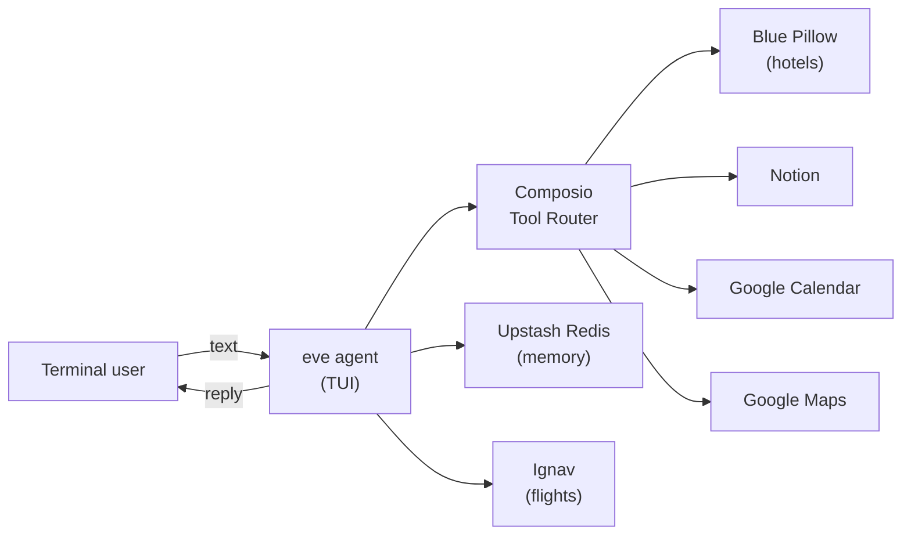

# TripPilot ✈️

**A travel-planning agent you run in the terminal.**

Talk to TripPilot like a friend — it searches real flights and hotels, saves your itinerary to Notion, blocks your calendar, and sends Google Maps links.

Built with [eve](https://eve.dev), run locally in the terminal UI, with live fares from [Ignav](https://ignav.com/mcp) and [Composio](https://composio.dev) for hotels, maps, Notion, and Calendar.

**[Watch the demo](https://youtu.be/8yOPQebV5PU)**

[](https://youtu.be/8yOPQebV5PU)

---

## What it does

1. **Gather trip details** — destination, dates, budget, preferences
2. **Search flights** — via Ignav MCP (`booking_url` on every fare)
3. **Find hotels** — via Blue Pillow (Composio)
4. **Save itinerary** — structured page in the user's Notion workspace
5. **Add calendar events** — flights, check-in, check-out, and walkable day-plan stops
6. **Share map links** — tappable Google Maps URLs on the trip brief
7. **Trip brief** — remaining budget, weather, real day stops, Maps links, packing, and Connect Links when apps are not connected
8. **Over-budget fork** — when spend exceeds budget, two code-backed recut plans (keep hotel vs keep flight)
9. **HITL approval** — parked Notion/Calendar writes: reply `approve` or `deny`

Each user connects their own Notion and Google Calendar accounts. TripPilot never mixes data between users.

Trip facts live in a typed session dossier (`update_trip` / `get_trip`). Spend vs budget is computed in code. Notion and Calendar writes go through approval-gated tools — the run parks until the user confirms.

---

## Architecture



**Local surface:** `npm run dev` — eve terminal UI

---

## Tech stack

| Layer | Technology |
|-------|------------|
| Agent framework | [eve](https://eve.dev) v0.53 |
| Surface | eve terminal (`npm run dev`) |
| Deploy | Vercel |
| Integrations | Ignav MCP (flights); Composio (Blue Pillow, Notion, Google Calendar, Google Maps) |
| Memory | Upstash Redis documents via `@upstash/agentkit-eve` |
| Model | `claude-haiku-4-5-20251001` (Anthropic) |

---

## Project structure

```
agent/
  instructions.md      # TripPilot identity and travel workflow
  agent.ts             # Model config
  lib/
    trip.ts            # Durable typed trip dossier (defineState)
    fork.ts            # Over-budget recut plans (keep hotel vs keep flight)
    tapback.ts         # approve / deny HITL replies
    destinations.ts    # Code-backed day-plan playbooks
    maps.ts / calendar.ts
    composio.ts        # Per-user session factory + write execute
    booking.ts         # Pass-through Ignav / Blue Pillow book URLs
  connections/
    ignav.ts           # Ignav MCP: search_airports + search_flights
  channels/
    eve.ts             # HTTP session API + terminal UI (OIDC + localDev)
  tools/
    composio.ts        # Search/connect tools, no process-wide cache
    update_trip.ts / get_trip.ts
    trip_brief.ts       # Code-backed days, packing, next actions
    budget_fork.ts     # Two recut plans when over budget
    save_itinerary.ts  # Notion write, approval: always()
    add_calendar_events.ts
    google_maps_link.ts
  memory/
    upstash-agentkit.ts  # Durable per-user memory
```

---

## Demo script

[Watch the recorded demo](https://youtu.be/8yOPQebV5PU)

Two minutes in the eve terminal. Talk like a traveler — never name tools.

**0:00** — “A travel agent in the terminal. It asks before it saves anything.”

**0:08** — send:

```
Tokyo 10–12 April from KL, budget $2000. I picked JL71 for $800 leaving 22:15 and Park Hyatt for $600. Send me the brief — packing, weather, days, and maps.
```

Point at remaining cash, 22:15, a Tokyo stop, and a Maps link.

**0:50** — send:

```
Wait, my budget is actually $400. What are my options?
```

Point at the two cheaper plans (keep the hotel vs keep the flight).

**1:20** — send:

```
Save this to Notion.
```

When it asks: reply `deny` to cancel, or `approve` to save.

**1:55** — “That write never goes through unless I approve.”

Skip live flight search and Notion login on camera.

---

## Local development

**Prerequisites:** Node.js 24.x, npm

```bash
npm install
# create .env — see Environment variables below
npm run dev            # opens eve TUI at localhost
```

Other commands:

```bash
npm run build
npm run deploy       # deploy to Vercel (loads .env automatically)
npm run typecheck
npm run eval:smoke   # run smoke evals (loads .env automatically)
npx eve channels list   # → eve
```

---

## Reliability & evaluation

Evals run against a local dev server via the same HTTP surface as production. Smoke covers boot + maps. Reliability covers the trip dossier and approval-gated writes. Usefulness covers the code-backed trip brief. Originality covers the over-budget fork and tapback deny mapping.

| Eval | Checks |
|------|--------|
| `smoke/greeting` | Agent responds to a hello without crashing |
| `smoke/trip-intake` | Trip prompt calls `update_trip` with Tokyo |
| `smoke/maps-link` | Location request returns a Google Maps URL |
| `reliability/budget-over` | $400 budget + $1800 flight → dossier + over-budget warning |
| `reliability/save-approval` | `save_itinerary` parks on HITL approval (`pending`) |
| `reliability/save-deny` | Deny the parked save → tool `rejected`, never `completed` |
| `reliability/save-approve` | Approve the parked save → tool leaves `pending` and executes |
| `reliability/calendar-approval` | `add_calendar_events` parks on HITL approval (`pending`) |
| `usefulness/trip-brief` | Tokyo + $800/$600 picks → brief with $600 left, stops, Maps, weather, flight time |
| `originality/budget-fork` | $400 budget + $1800 flight → `budget_fork` + keep-hotel / keep-flight recuts |
| `originality/tapback-deny` | 👎 maps to deny → parked `save_itinerary` is `rejected`, never `completed` |

```bash
npm run eval:smoke
npm run eval:reliability
npm run eval:usefulness
npm run eval:originality
# or all evals:
npm run eval
```

Runs use `maxConcurrency: 1`.

**Latest full run:** 11/11 passed · 56/56 gates · `claude-haiku-4-5-20251001` · 1m 15s

```
✓ originality/budget-fork          8/8
✓ originality/tapback-deny         7/7
✓ reliability/budget-over          5/5
✓ reliability/calendar-approval    3/3
✓ reliability/save-approval        3/3
✓ reliability/save-approve         6/6
✓ reliability/save-deny            8/8
✓ smoke/greeting                   2/2
✓ smoke/maps-link                  2/2
✓ smoke/trip-intake                3/3
✓ usefulness/trip-brief            9/9
```

Committed proof for judges:

- [`evals/results/smoke-summary.json`](evals/results/smoke-summary.json)
- [`evals/results/reliability-summary.json`](evals/results/reliability-summary.json)
- [`evals/results/usefulness-summary.json`](evals/results/usefulness-summary.json)
- [`evals/results/originality-summary.json`](evals/results/originality-summary.json)

Full local artifacts live under `.eve/evals/` (gitignored as build output).

**Judges can verify by either:**

1. Reading the committed summaries in `evals/results/`
2. Cloning and running `npm run eval:smoke` / `npm run eval:reliability` / `npm run eval:usefulness` / `npm run eval:originality` (requires `.env`)
3. Inspecting `evals/smoke/*.eval.ts`, `evals/reliability/*.eval.ts`, and `evals/originality/*.eval.ts`

Memory uses Upstash Redis document storage (`fileMemory` + `redisDocuments`) — durable per-user notes without RediSearch, compatible with Upstash free tier.

Writes to Notion and Google Calendar are **approval-gated** (`save_itinerary`, `add_calendar_events`). The same slugs are blocked on raw Composio tools via `requireApprovalForTools`, so the model cannot skip the human pause.

---

## Environment variables

Create a `.env` file in the project root:

```bash
# Anthropic (direct, not AI Gateway)
ANTHROPIC_API_KEY=

# Ignav MCP (flights)
IGNAV_API_KEY=

# Composio Platform (hotels, maps, Notion, Calendar)
COMPOSIO_API_KEY=

# Upstash Redis (memory)
UPSTASH_REDIS_REST_URL=
UPSTASH_REDIS_REST_TOKEN=
```

Set the same variables in **Vercel → Project → Environment Variables** (Production) before deploying.

### Ignav setup

1. Create an API key at [ignav.com](https://ignav.com)
2. Set `IGNAV_API_KEY` locally and in Vercel. Flight search uses the hosted MCP at `https://ignav.com/mcp`.

### Composio setup

1. Get a Platform API key from [dashboard.composio.dev](https://dashboard.composio.dev/)
2. Users connect Notion and Google Calendar in-chat via OAuth Connect Links (sent automatically when needed)

---

## Deploy

`npm run deploy` loads `.env` locally so the build can resolve Ignav, Composio, Upstash, and Anthropic credentials. Git-connected Vercel builds skip a missing `.env` and use **Vercel → Environment Variables** instead.

```bash
npm run deploy
```

Production URL: `https://trippilot-dzulhelmy.vercel.app`

---

## Learn more

- [eve documentation](https://eve.dev/docs)
- [eve HTTP / terminal channel](https://eve.dev/docs/channels/eve)
- [Ignav MCP](https://ignav.com/mcp)
- [Composio + eve provider](https://docs.composio.dev/docs/providers/eve)
- [Build an Agent tutorial](https://eve.dev/docs/tutorial/first-agent)
